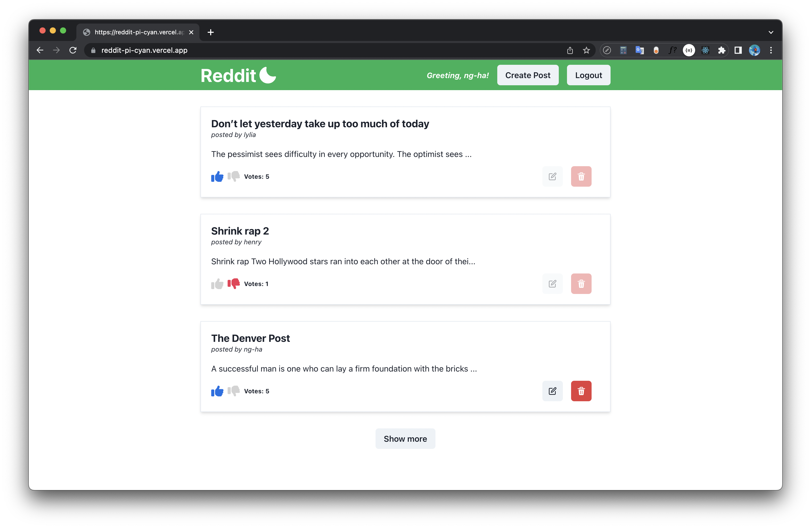

# Reddit clone fullstack using GraphQL and NextJs 💥

### Link Demo 📌

[https://reddit-pi-cyan.vercel.app/](https://reddit-pi-cyan.vercel.app/)

### Features :computer:

A small project with the most advanced technologies:

- Basic CRUD with **PostgresQL** using **GraphQL**
- Authentication using hashed cookies with **express-session**
- Forgot password feature: verify through email sent with node-mailer
- SSG and SSR website with **NextJs**
- Upvote and downvote posts
- Pagination posts

### Technologies ✨

Backend:

- NodeJs
- ExpressJs
- Typescipt
- **GraphQL** + Type-GraphQL + @apollo/server
- **PostgresQL** Database + Typeorm
- MongoDb (typegoose + mongoose)
- Express-session
- Node-mailer
- **DataLoader** for optimized performance

Frontend:

- **NextJs**
- **Typescript**
- ChakraUI
- Formik
- **@apollo/client**
- **@graphql-codegen/cli** for generating code automatically based on a GraphQL schema and GraphQL operations

### License :right_anger_bubble:

[MIT](https://choosealicense.com/licenses/mit/)
